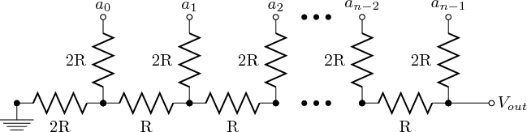
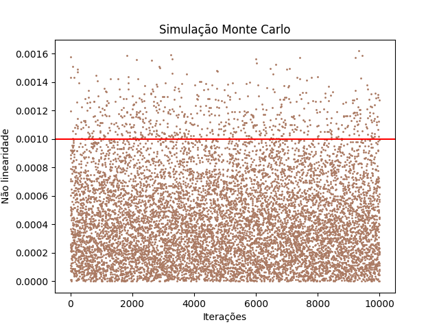

# dac-nonlinearity-resistor-analysis
When working with converters, precision is important, and it's known that commercial resistors tend to vary in their resistors values. This code is a tool to analise how adequate the chosen tolerance is to your project, based on hte Monte Carlo simulation.

This code works on the r2r topology, and all you have to do is define the value of vref (the voltage reference, or maximum voltage value); vectors r (vector of resistors  in the position of the R value); vectors rb (vector of resistors in the position of the 2R value); rx (resistor representing the first resistor grounded); tol (the commercial tolerance for the resistors). To simplify the calculations, the nonlinearity caused by the inverter amplifier is not considered.

Here, there is a generalized model of the circuit:

The model of DAC utilized here uses up to 10 bits to represent a binary value and a maximum output 10.23 Volts, correlating to the number of 1023 (maximum value from 1 0 bits). By calculating in a recursive way the Thevenin equivalent, the code is capable of finding how much the final value differs from the expected (10.23 in this case).

The result is a graph like the one below.

